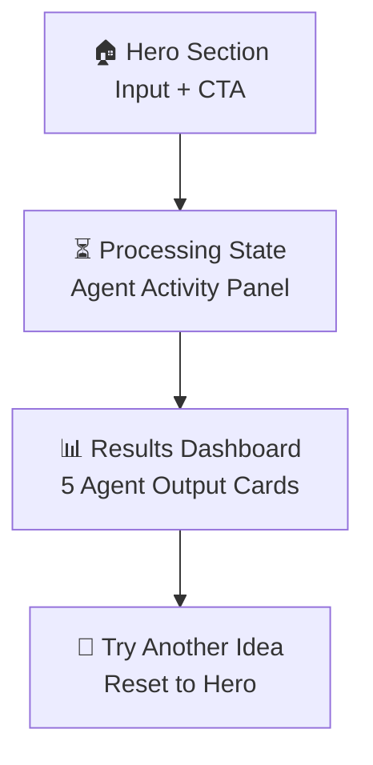
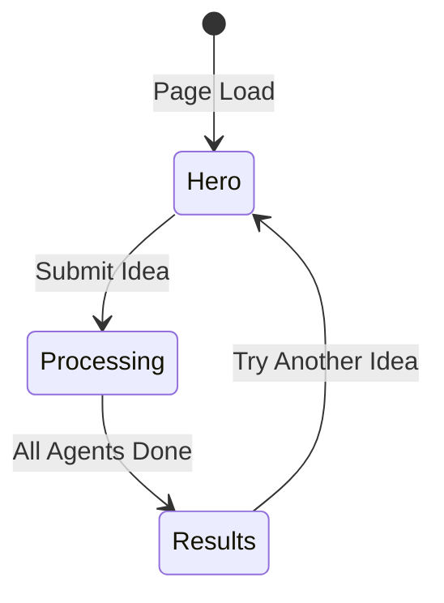

# AI Founder OS — Frontend Layout Proposal

## Overview

Your backend is solid — 5 specialized agents running in parallel via an orchestrator, exposed through a single `/api/orchestrate` POST endpoint. The frontend needs to do three things well:

1. **Capture the idea** — a hero input experience
2. **Show progress** — real-time agent activity while waiting
3. **Present results** — a structured, navigable dashboard of all 5 agent outputs

---

## Page Structure (Single Page App)



---

## Section 1: Hero — The Input Experience

> The first screen. Dark, cinematic, minimal. One big question.

| Element | Details |
|---------|---------|
| **Background** | Deep dark gradient (#0a0a0f → #111827) with subtle animated particles or grid lines |
| **Headline** | `"Describe your startup idea."` — large, bold, Inter/Outfit font |
| **Subtext** | `"Our AI founding team will validate, research, plan, architect, and market it — in seconds."` |
| **Input** | Large `<textarea>` with a glowing border on focus (gradient: violet → cyan). Placeholder: *"e.g. AI-powered fitness coach for busy professionals"* |
| **CTA Button** | `"Launch Agents →"` — pill-shaped, gradient fill, subtle pulse animation on hover |
| **Agent Badges** | Below the input: 5 small pills showing agent names with icons — `🧠 Advisor · 📊 Research · 📋 Product · ⚙️ Architect · 🚀 Marketing` |

### Layout

```
┌─────────────────────────────────────────────────────┐
│                                                     │
│            [Logo / Brand Mark]                      │
│                                                     │
│         Describe your startup idea.                 │
│    Our AI founding team will validate, research,    │
│      plan, architect, and market it — in seconds.   │
│                                                     │
│   ┌─────────────────────────────────────────────┐   │
│   │                                             │   │
│   │   [textarea — 3-4 rows, glowing border]     │   │
│   │                                             │   │
│   └─────────────────────────────────────────────┘   │
│                                                     │
│              [ 🚀 Launch Agents → ]                 │
│                                                     │
│    🧠 Advisor  📊 Research  📋 Product  ⚙️ Arch  🚀 Mktg │
│                                                     │
└─────────────────────────────────────────────────────┘
```

---

## Section 2: Processing State — Agent Activity Panel

> Shown after clicking "Launch Agents". The hero collapses/fades up, and a full-screen processing view takes over.

| Element | Details |
|---------|---------|
| **Idea Echo** | The submitted idea shown in a subtle card at the top |
| **Agent Status Grid** | 5 cards in a row (or 2×3 grid on mobile), each representing an agent |
| **Per-Agent Card** | Shows: icon, agent name, animated spinner/pulse, status text (`"Analyzing market..."`) |
| **Completion** | As each agent finishes, its card gets a ✓ checkmark with a green glow and a "Done" label |
| **Overall Progress** | A thin progress bar at the top or a `3/5 agents complete` counter |

### Layout

```
┌─────────────────────────────────────────────────────┐
│  ─────────── [progress bar: 3/5] ────────────       │
│                                                     │
│  "AI-powered fitness coach for busy professionals"  │
│                                                     │
│  ┌──────────┐ ┌──────────┐ ┌──────────┐            │
│  │ 🧠       │ │ 📊       │ │ 📋       │            │
│  │ Advisor  │ │ Research │ │ Product  │            │
│  │  ✓ Done  │ │ ⏳ ...   │ │  ✓ Done  │            │
│  └──────────┘ └──────────┘ └──────────┘            │
│                                                     │
│  ┌──────────┐ ┌──────────┐                          │
│  │ ⚙️       │ │ 🚀       │                          │
│  │ Architect│ │ Marketing│                          │
│  │ ⏳ ...   │ │ ⏳ ...   │                          │
│  └──────────┘ └──────────┘                          │
│                                                     │
└─────────────────────────────────────────────────────┘
```

> [!IMPORTANT]
> Currently, your API returns all results at once (no streaming). To make this section genuinely real-time, you'd need to either:
> - **Option A**: Switch to Server-Sent Events (SSE) / streaming — agents push results as they complete
> - **Option B**: Fake progressive loading with staggered animations (simpler, still feels good)

---

## Section 3: Results Dashboard

> The main payoff. All 5 agent outputs displayed as expandable, navigable cards.

### Layout Option: Tabbed Dashboard (Recommended)

A horizontal tab bar at the top lets the user switch between agent outputs. Each tab reveals a rich markdown-rendered card below.

```
┌─────────────────────────────────────────────────────┐
│                                                     │
│  "AI-powered fitness coach for busy professionals"  │
│                                                     │
│  ┌────────┬────────┬─────────┬──────────┬────────┐  │
│  │🧠 Adv. │📊 Rsrch│📋 Prod. │⚙️ Arch.  │🚀 Mktg│  │
│  └────────┴────────┴─────────┴──────────┴────────┘  │
│  ┌─────────────────────────────────────────────┐    │
│  │                                             │    │
│  │  [Active Tab Content — rendered markdown]    │    │
│  │                                             │    │
│  │  ## Problem Statement                       │    │
│  │  Many busy professionals struggle to...     │    │
│  │                                             │    │
│  │  ## Target Audience                         │    │
│  │  - Working professionals aged 25-45...      │    │
│  │                                             │    │
│  │  ## Business Model                          │    │
│  │  Freemium SaaS with tiered pricing...       │    │
│  │                                             │    │
│  └─────────────────────────────────────────────┘    │
│                                                     │
│     [ 🔄 Try Another Idea ]   [ 📥 Export All ]     │
│                                                     │
└─────────────────────────────────────────────────────┘
```

### Layout Option: Vertical Card Stack (Alternative)

All 5 results shown as collapsible accordion cards, stacked vertically. Good for scrolling on mobile.

```
┌─────────────────────────────────────────────────────┐
│                                                     │
│  ┌─── 🧠 Startup Advisor ──── [▼ collapse] ────┐   │
│  │  Problem Statement...                        │   │
│  │  Target Audience...                          │   │
│  └──────────────────────────────────────────────┘   │
│                                                     │
│  ┌─── 📊 Market Research ──── [▼ collapse] ────┐   │
│  │  Top 3 Competitors...                        │   │
│  │  Market Size (TAM)...                        │   │
│  └──────────────────────────────────────────────┘   │
│                                                     │
│  ┌─── 📋 Product Manager ──── [► expand] ──────┐   │
│  └──────────────────────────────────────────────┘   │
│                                                     │
│  ┌─── ⚙️ Architect ────────── [► expand] ──────┐   │
│  └──────────────────────────────────────────────┘   │
│                                                     │
│  ┌─── 🚀 Marketing ────────── [► expand] ──────┐   │
│  └──────────────────────────────────────────────┘   │
│                                                     │
└─────────────────────────────────────────────────────┘
```

---

## Visual Design Direction

| Aspect | Recommendation |
|--------|---------------|
| **Theme** | Dark mode primary, with subtle glassmorphism on cards |
| **Colors** | Dark navy/charcoal base (`#0a0a0f`). Accent gradient: violet-500 → cyan-400 for CTAs and focus states. Agent icons get unique colors. |
| **Typography** | `Inter` or `Outfit` from Google Fonts. Hero headline: 48–56px bold. Body: 16px regular. |
| **Cards** | `backdrop-filter: blur(12px)`, semi-transparent backgrounds (`rgba(255,255,255,0.05)`), 1px subtle borders |
| **Animations** | Fade-in-up on section transitions. Pulse on loading spinners. Staggered card reveals in results. Smooth tab transitions. |
| **Markdown Rendering** | Use a library like `react-markdown` to render agent outputs with proper headings, lists, and code blocks |

---

## Component Breakdown

| Component | Purpose |
|-----------|---------|
| `HeroInput` | Textarea + submit button + agent badges |
| `AgentStatusGrid` | 5 agent status cards during processing |
| `AgentStatusCard` | Individual agent: icon, name, loading/done state |
| `ResultsDashboard` | Tab bar + content panel for the 5 agent outputs |
| `ResultTab` | Individual tab content — renders markdown |
| `MarkdownRenderer` | Wraps `react-markdown` with styled prose |
| `ProgressBar` | Thin top bar showing `n/5 complete` |
| `ExportButton` | Optional: export all results as PDF/Markdown |

---

## User Flow Summary



1. **Land** → Dark hero, type idea, hit "Launch Agents"
2. **Wait** → See 5 agent cards animate through loading states
3. **Explore** → Tab between 5 rich markdown outputs
4. **Repeat** → Click "Try Another" to reset

---

## Open Questions

> [!IMPORTANT]
> **Streaming vs. Batch**: Your current API returns all 5 results at once. Do you want to add SSE/streaming so results appear as each agent finishes? This would make the processing screen feel much more alive, but requires backend changes.

> [!IMPORTANT]
> **Layout preference**: Do you prefer the **tabbed dashboard** (cleaner, focused) or the **vertical accordion** (scrollable, all-at-once) for displaying results?

> [!NOTE]
> **Export feature**: Would you like an "Export All" button that downloads the combined results as a Markdown/PDF file?

> [!NOTE]
> **History**: Should we save past ideas and results (localStorage or DB) so users can revisit previous analyses?
